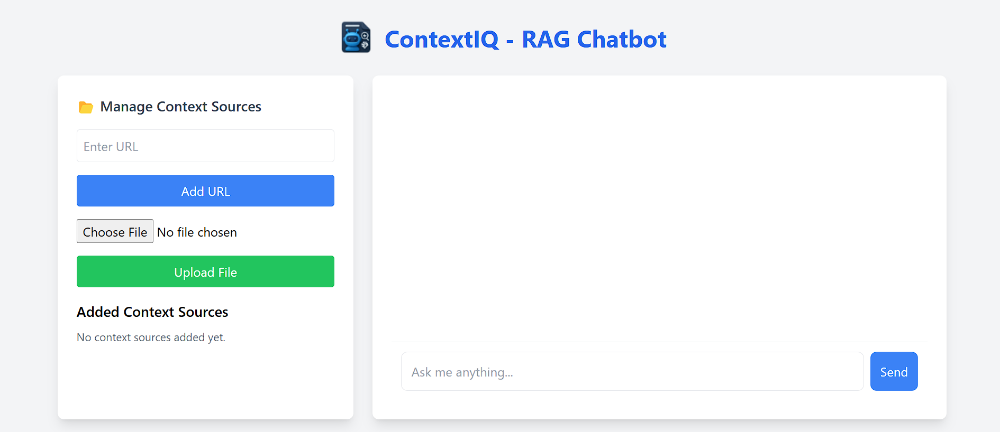
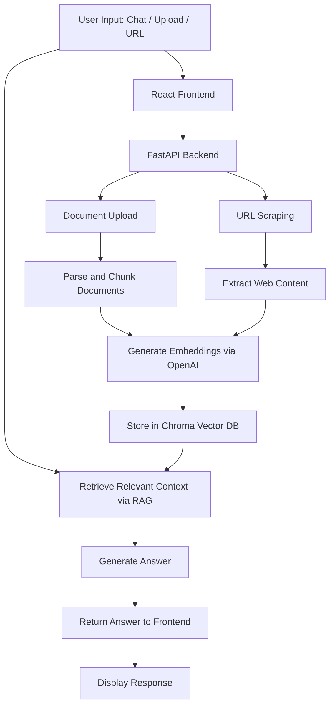

# 🧠 ContextIQ - RAG Chatbot 🤖

<div align="center">



[](LICENSE)
[](https://www.python.org/downloads/)
[](https://langchain.com)
[](https://openai.com)

<p align="center">
  <a href="#-overview">Overview</a> •
  <a href="#-features">Features</a> •
  <a href="#-how-it-works">How It Works</a> •
  <a href="#-installation">Installation</a> •
  <a href="#-usage">Usage</a> •
  <a href="#-tech-stack">Tech Stack</a>
</p>

</div>

## 🌟 Overview

**ContextIQ** is a sleek, AI-powered chatbot that allows you to chat with your files and URLs using Retrieval-Augmented Generation (RAG). With a responsive UI, document upload capabilities, and conversational memory, ContextIQ helps you extract contextually relevant answers from any source you provide.

> 🔍 Upload files, add URLs, and let the bot fetch accurate answers from your custom context.

---

## ✨ Features

- 🧠 Conversational memory with multi-turn chat history
- 📄 PDF, DOCX, and TXT document upload support
- 🌐 URL ingestion with BeautifulSoup scraping
- 🔎 ChromaDB vector search with OpenAI embeddings
- 💬 Chatbot-style frontend UI (typing effect + alignment)
- ⚡ Powered by FastAPI backend and React + Tailwind frontend

---

## 🛠️ How It Works

<div align="center">



</div>

---

## 🚀 Installation

### 📦 Backend Setup
```bash
git clone https://github.com/het0814/ContextIQ-rag-chatbot.git
cd backend

# Create virtual environment
python -m venv venv
source venv/bin/activate  # On Windows use `venv\Scripts\activate`

# Install Python dependencies
pip install -r requirements.txt

# Add your OpenAI key
export OPENAI_API_KEY=your-api-key
uvicorn main:app --reload
```

### 💻 Frontend Setup
```bash
cd ../frontend
npm install
npm run dev
```

---

## 💡 Usage

### 🔗 Upload a URL
```bash
POST /add-url
{ "url": "https://www.bbc.com/news" }
```

### 📁 Upload a Document
```bash
POST /upload-document
(file = .pdf / .docx / .txt)
```

### 💬 Ask a Question
```bash
POST /generate-response
{ "query": "What’s the latest news?" }
```

---

## 🧱 Tech Stack

| Layer       | Tech Used                      |
|-------------|--------------------------------|
| Frontend    | React, Tailwind CSS, Framer Motion |
| Backend     | FastAPI, Python                |
| LLM         | OpenAI GPT-4o (via LangChain)  |
| Embeddings  | OpenAI Embeddings              |
| Vector DB   | ChromaDB                       |
| Memory      | ConversationBufferMemory       |

---

## 🧠 Future Roadmap

- [ ] Markdown rendering in responses
- [ ] Source highlighting per answer
- [ ] Multi-user chat sessions
- [ ] Dark mode toggle
- [ ] Response citation UI

---

## 👥 Contributing

Contributions are welcome!  
To contribute:
1. Fork this repo
2. Create a branch (`git checkout -b feature/add-citation`)
3. Commit changes
4. Push (`git push origin feature/add-citation`)
5. Open a pull request 🚀

---

## 📄 License

This project is under the **MIT License**. Feel free to use it in personal or commercial projects.  
See [LICENSE](LICENSE) for full terms.

---

<div align="center">
  <strong>⭐ Star this project if you like it ; contributions welcome!</strong>
</div>
